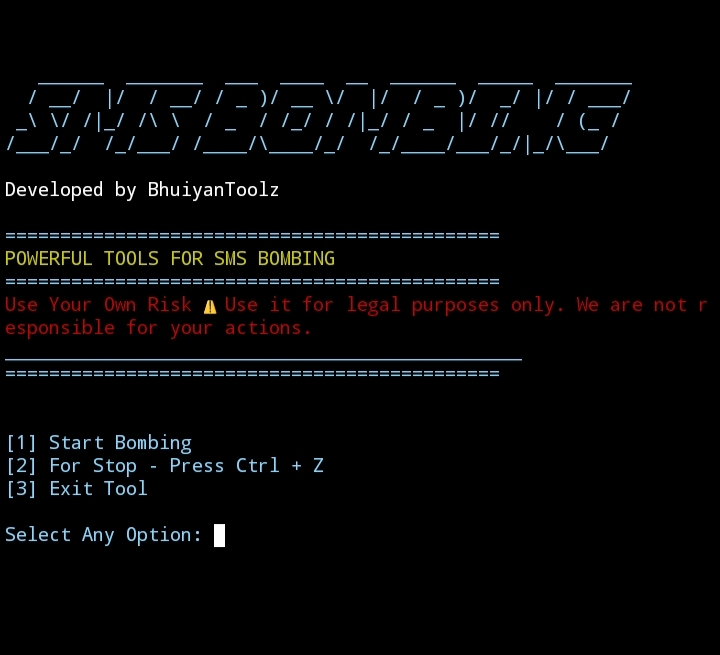

# BhuiyanToolZ
SMS-Bomber-Pro-BD powerful Python-based SMS bombing tool using multiple APIs to send OTP messages rapidly. Designed for educational purposes and testing only. Developed by BhuiyanToolz.  Welcome to BhuiyanToolz SMS Bombing Tool 🚀
<!DOCTYPE html>
<html lang="en">
<head>
<meta charset="UTF-8" />
</head>
<body>

<marquee behavior="scroll" direction="left" scrollamount="10" style="color:green; font-weight:bold; font-size:24px;">
Welcome to BhuiyanToolz SMS Bombing Tool 🚀
</marquee>

<h1 style="color:orange; text-shadow: 2px 2px 5px green;">BhuiyanToolz SMS Bombing Tool</h1>

<strong>Disclaimer:</strong> Use this tool at your own risk. This tool is intended for educational purposes only. The author is not responsible for any misuse.

<h2 style="color:darkblue;">Installation Instructions</h2>

<pre style="background:#f4f4f4; padding:10px; border:1px solid #ccc;">
pkg update && pkg upgrade
pkg install python
pip install requests
git clone https://github.com/BhuiyanToolsZ/SMS-Bomber-Pro-BD.git
cd SMS-Bomber-Pro-BD
python sms_bombing.py
</pre>

<h2 style="color:purple;">Usage</h2>
<ul>
<li>Run the tool with <code>python sms_bombing.py</code></li>
<li>Choose option <strong>1</strong> to start bombing</li>
<li>Enter target number without country code <code>+88</code></li>
<li>Enter amount of SMS to send</li>
<li>Use <strong>Ctrl + Z</strong> to stop anytime</li>
<li>Choose option <strong>3</strong> to exit the tool</li>
</ul>

<h2 style="color:darkred;">Important Notes</h2>
<ul>
<li>Make sure your device has internet connection</li>
<li>Use responsibly &amp; never for illegal activities</li>
<li>This tool is for educational &amp; testing purposes only</li>
</ul>

<h3 style="color:teal;">Developed by BhuiyanToolz</h3>

</body>
</html>
